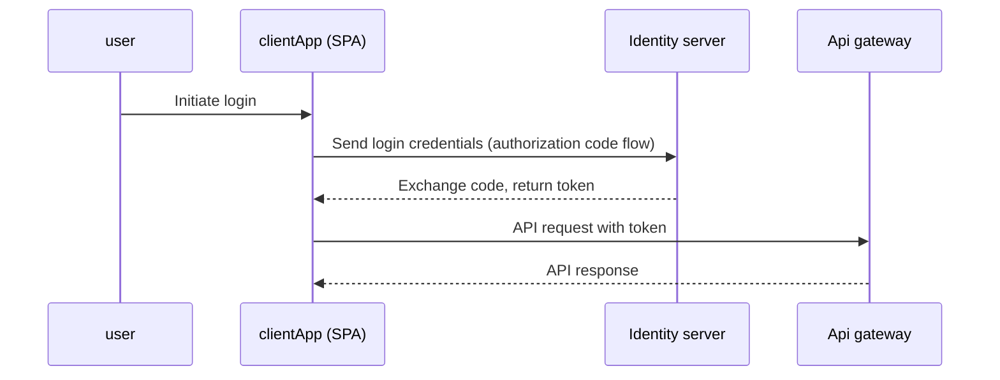

# imagespeak.frontend

## Description
A tool that leverages AI to generate insightful captions and detailed descriptions from images, making visual content more accessible and meaningful.

## Architecture Diagram


## Sequence Diagram



## Run Commands

### Start development server
```
npm run dev
```

### Build for production
```
npm run build
```

### Preview production build
```
npm run preview
```
